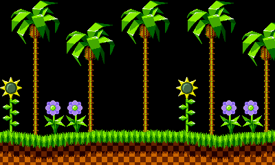

# FBTilengine
[](https://opensource.org/licenses/MIT)
## About FBTilengine
FBTilengine is the FreeBasic binding for Tilengine. It is a direct 1:1 API translation of the original C library, so it is used and works exactly as its C counterpart. This binding is originally built by @MyTDT-Mysoft and tweaked a bit by @megamarc

## Contents

File(s)               | Description
----------------------|----------------------------------------------------------------
`Tilengine.bi`        | header of the binding, required to build the samples
`Tilengine.dll`       | prebuilt required Tilengine binary for 32-bit windows
`SDL2.dll`            | prebuilt required SDL2 binary for 32-bit windows
`mode7.bas`           | ported "Mode7" sample from original C sources
`Racer.bas`           | ported "Racer" sample from original C sources
`SuperMarioClone.bas` | ported "SuperMarioClone" sample from original C sources
`*.bas`               | several original samples and support files in FreeBasic source
`/assets`             | graphic data used by the samples

## Prerequisites
1. FreeBasic compiler must be installed. Please go to https://www.freebasic.net/ <br>
2. Tilengine native shared library must be installed separately. Please refer to https://github.com/megamarc/Tilengine about how to do it.<br>
For convenience, Windows 32-bit versions of Tilengine.dll and SDL2.dll are bundled.<br>

## Documentation
Work in progress of the C API documentation can be found here:<br>
http://www.tilengine.org/doc/

## Installation
No install step is required. Just make sure that the Tilengine library (*Tilengine.dll* and *Tilengine.bi*) are accessible from within your own project

## Basic program
The following program does these actions:
1. Import required classes from tilengine binding
2. Initialize the engine with a resolution of 400x240, one layer, no sprites and 20 animation slots
3. Set the loading path to the assets folder
4. Load a *tilemap*, the asset that contains background layer data
5. Attach the loaded tilemap to the allocated background layer
6. Create a display window with default parameters: windowed, auto scale and CRT effect enabled
7. Run the window loop, updating the display at each iteration until the window is closed

Source code:
```vbnet
#include "Tilengine.bi"

dim foreground as TLN_Tilemap
dim frame as integer

TLN_Init (400,240,1,0,20)
TLN_SetLoadPath ("assets/sonic")
foreground = TLN_LoadTilemap ("sonic_md_fg1.tmx", NULL)
TLN_SetLayer (0, NULL, foreground)

TLN_CreateWindow (NULL, 0)
while (TLN_ProcessWindow())
	TLN_DrawFrame (frame)
	frame += 1
wend

TLN_Deinit ()
```

Resulting output:



## Building the samples
To build the samples, just open a terminal window inside the main directory and run any of these commands:
```
fbc mode7.bas
fbc Racer.bas
fbc SuperMarioClone.bas
fbc learning.bas
fbc fbgfx-composing.bas
fbc fbgfx-composing2.bas
fbc composing.bas
fbc composing2.bas
fbc test.bas
```

## License
FBTilengine is released under the permissive MIT license
